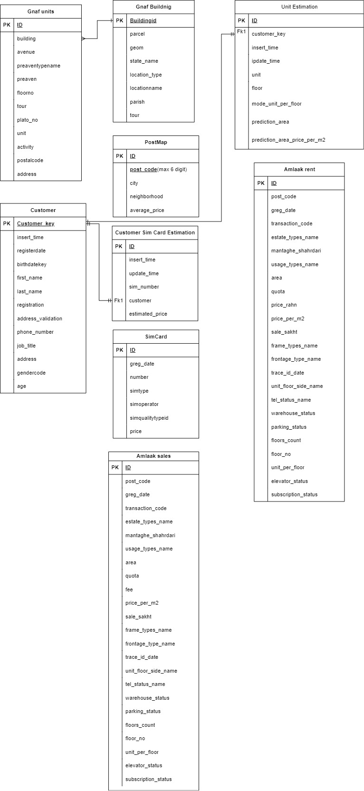
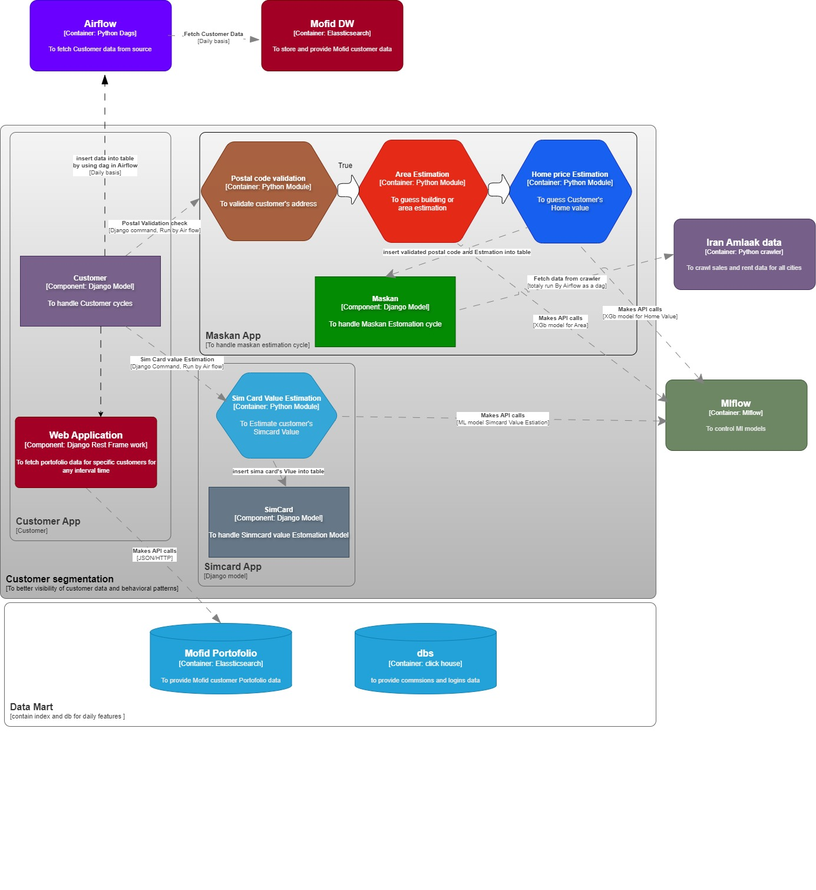

# Django project for customer segmentation


## How to Use:

1. Clone the repository.
2. docker volume create static_volume
3. docker network create customer_segmentation_project_network
4. docker compose -f docker/base/docker-compose.yml up  --build  -d 
5. docker compose -f docker/app/docker-compose.yml  up  --build  -d 

notice to have .env file

## .env sample:
```plaintext

# Database settings
POSTGRES_DB=
POSTGRES_USER=
POSTGRES_PASSWORD=
POSTGRES_HOST=
POSTGRES_PORT=
# General settings
DJANGO_SECRET_KEY=
DJANGO_DEBUG= 
DJANGO_ALLOWED_HOSTS=
```

## relations and architecture:





